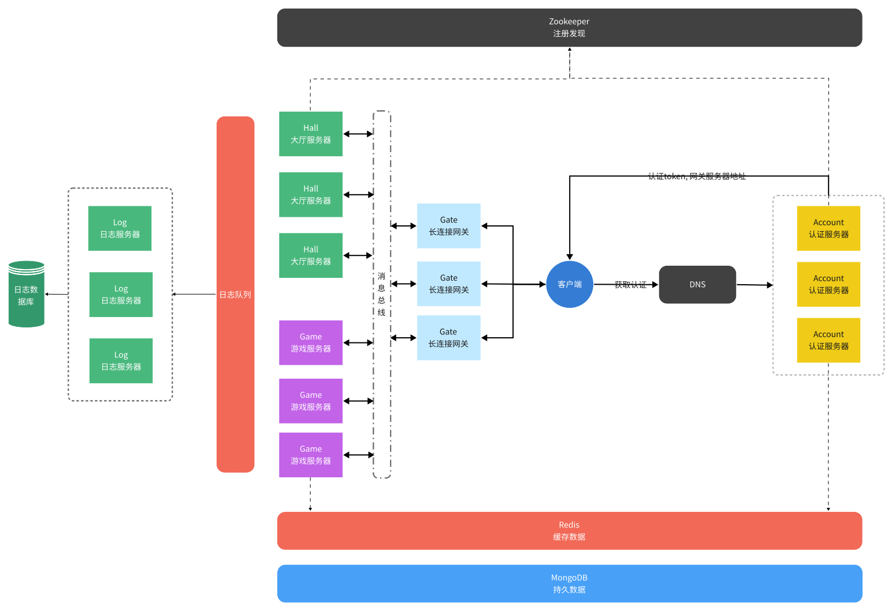
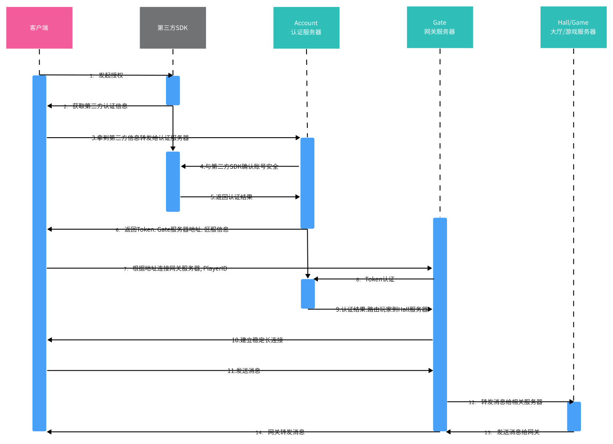

## 一个分布式长连接的服务器架构
[](https://www.jetbrains.com/?from=RuoYi-Vue-Plus)
[]()
[]()
[](https://netty.io/)
[](https://www.mongodb.com/)
[](https://redis.io/)
[](https://developers.google.cn/protocol-buffers)
### 服务器构建图


### 消息协议

| 说明  | 长度   | 类型号    | 命令号    | Body  |
|-----|------|--------|--------|-------|
| 长度  | 4字节  | 2字节    | 2字节    | N字节   |
| 类型  | uint | ushort | ushort | bytes |

> 长度计算方式: 长度 = 4(类型号+命令号长度) + Body.size (消息体长度)
> 
> 序列化方式: Protocol buffer

### 客户端消息时序图

### 节点配置
````yaml
cluster:
 #节点类型
 type: ACCOUNT
 #节点名称
 name: CHOW_ACCOUNT
 #节点的Tcp地址
 tcp-address:
  port: 11002
  host: 10.10.10.126
 #节点权重
 weight: 1
 #节点IP白名单 若配置代表: 未在包含中的IP不可使用该节点
 white-ip-list: 
   - 10.10.10.23
   - 10.10.10.25
 #节点用户ID白名单 若配置代表: 未在包含中的用户ID不可使用该节点
 white-id-list:
   - 10001
   - 10002
 #工作线程池线程数: 建议数量为CPU核心数*2
 work-pool-num: 8
#Http 端口号
server:
  port: 6415
````
> 节点配置也有动态加载方式, 可以通过Json文件动态定义节点权重. 黑白名单等信息.
````json
{
  "weight": 1,
  "whiteIpList":[],
  "whiteIdList": []
}
````

